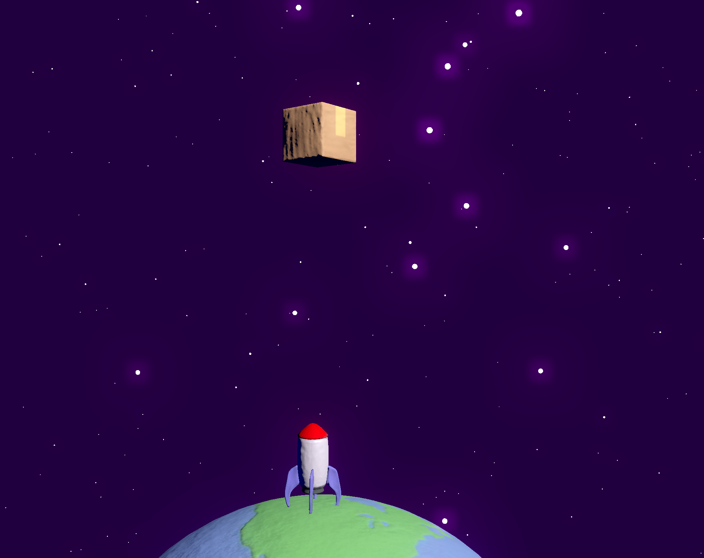

# Space Courier

A small game concept I made in Godot to start getting (back) into gamedev. It's kinda like snake but in space! Built using Godot 4 Alpha 7.

I always struggle with scope creep when trying to get into a gamedev project, so this time I wanted to build something with the mindset of a gamejam. I had a week-plus vacation from work, so my goal was to build and publish a game before my vacation was over. By the end of the week, I had something that was playable with most of the art in place to boot, but I held off on publishing it until I got a few kinks ironed out. So, I didn't meet my original goal, but I still feel that this was a positive expierence overall!

Since that first week or so of progress, I've added music and sound effects, a few settings in the main menu, a few gameplay and visual tweaks, and some performance improvements. I also implemented controller support with help and contributions from @asheliahut!

## License

Unless otherwise specified, all source code in this repo and all _original_ assets are available under the terms of the MIT license, the terms of which are provided below:

> Copyright © 2022 Kyle Lacy
>
> Permission is hereby granted, free of charge, to any person obtaining a copy of this software and associated documentation files (the “Software”), to deal in the Software without restriction, including without limitation the rights to use, copy, modify, merge, publish, distribute, sublicense, and/or sell copies of the Software, and to permit persons to whom the Software is furnished to do so, subject to the following conditions:
>
> The above copyright notice and this permission notice shall be included in all copies or substantial portions of the Software.
>
> THE SOFTWARE IS PROVIDED “AS IS”, WITHOUT WARRANTY OF ANY KIND, EXPRESS OR IMPLIED, INCLUDING BUT NOT LIMITED TO THE WARRANTIES OF MERCHANTABILITY, FITNESS FOR A PARTICULAR PURPOSE AND NONINFRINGEMENT. IN NO EVENT SHALL THE AUTHORS OR COPYRIGHT HOLDERS BE LIABLE FOR ANY CLAIM, DAMAGES OR OTHER LIABILITY, WHETHER IN AN ACTION OF CONTRACT, TORT OR OTHERWISE, ARISING FROM, OUT OF OR IN CONNECTION WITH THE SOFTWARE OR THE USE OR OTHER DEALINGS IN THE SOFTWARE.

Additionally, multiple third-party assets have been used and are also included in this repo. A full list of such assets can be found in [`external_sources.txt`](./external_sources.txt). Refer to the licenseholder for the exact usage rights for any third-party assets.
